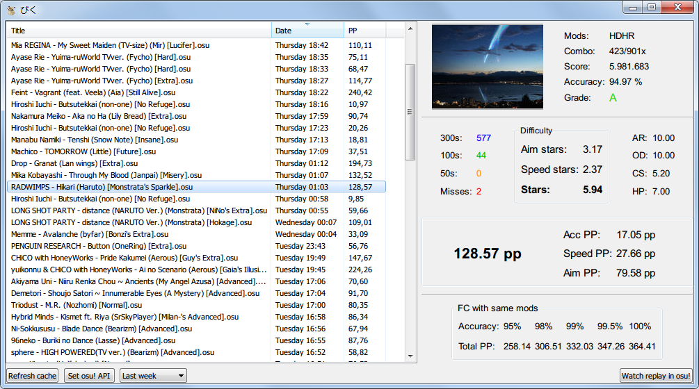

# biku 

osu! replay inspector which lets you see all the recent replays you made and PP info about them. 



## Build

```
go build -ldflags="-H windowsgui"
```

## Libs used

- GUI: [lxn/walk](https://github.com/lxn/walk) 
- PP calculation: [oppai5](https://github.com/flesnuk/oppai5) (oppai version written in Go)
- .osr and osu!.db parsing: [osu-tools](https://github.com/flesnuk/osu-tools)
- osu! API: [go-osuapi](https://github.com/thehowl/go-osuapi)